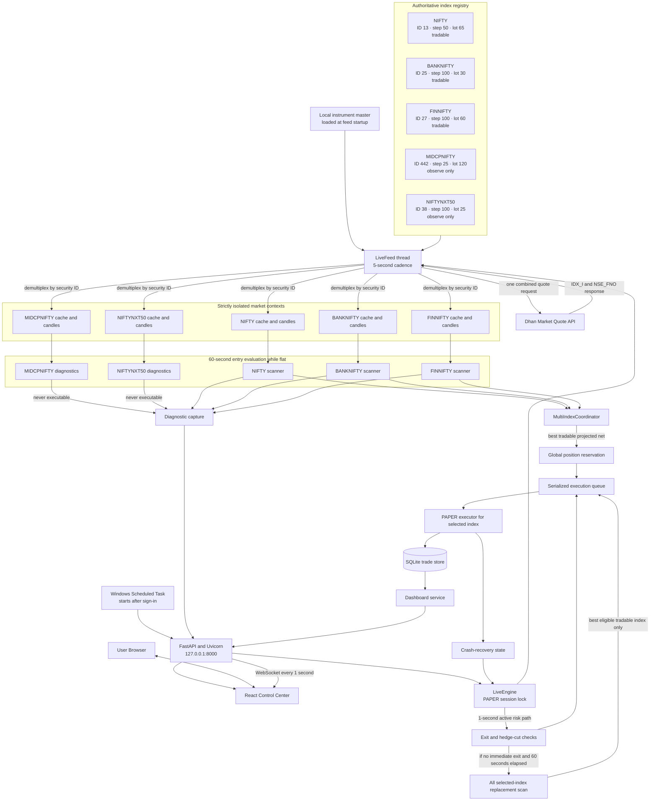
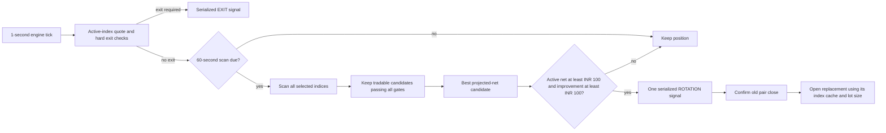
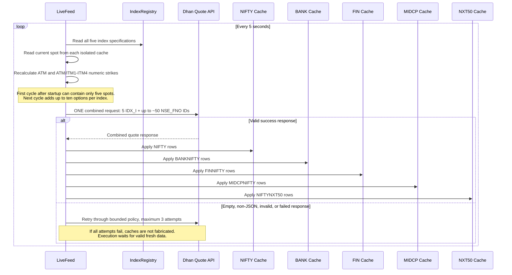
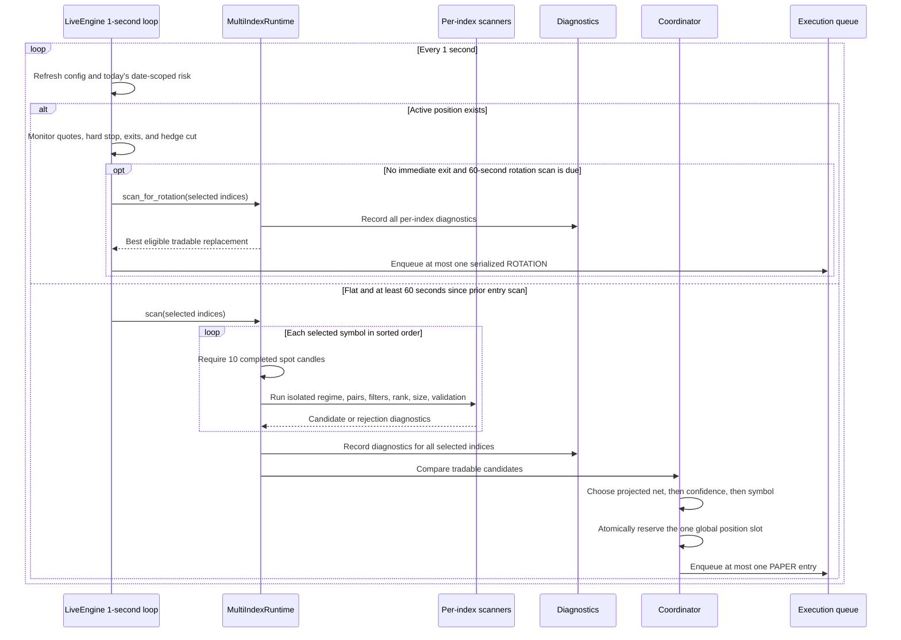
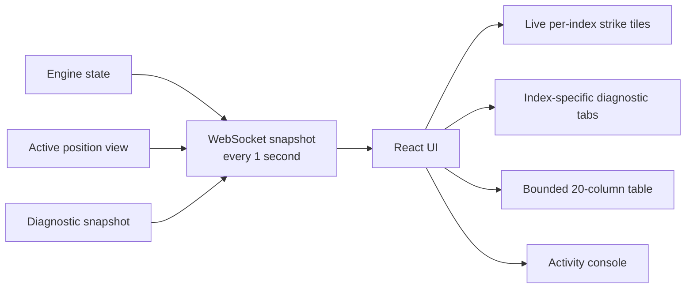

# AutoTrader Runtime Architecture

**Status:** PAPER validation runtime  
**Scope:** Multi-index data acquisition, dynamic ATM/ITM selection, strategy cadence, diagnostics, execution serialization, recovery, and UI updates.

## 1. Cadence and concurrency summary

| Path | Frequency | Call shape | Parallel or sequential? | Safety behavior |
|---|---:|---|---|---|
| Dhan quote polling | Every 5 seconds | One combined request containing five `IDX_I` spot IDs and up to approximately 50 `NSE_FNO` option IDs | One network call; response rows are demultiplexed sequentially into isolated caches | Up to three bounded attempts on a failed/invalid response; no synthetic fallback |
| Dynamic strike resolution | Every quote cycle after spots exist | Five CE strikes and five PE strikes per index | Sequential, deterministic loop over index metadata | Uses current spot and index-specific strike step; no fixed numeric strikes |
| Spot/option candle aggregation | Every successful quote response | Ticks are assigned to symbol-specific one-minute candle keys | Sequential response processing; isolated state | Invalid/non-positive prices are skipped |
| Engine risk loop | Every 1 second | Reads current configuration and active position state | One background engine thread | If a position is open, risk/exits run first; replacement discovery runs separately on the 60-second completed-candle cadence |
| Entry scan | Every 60 seconds while flat and inside entry window | One `MultiIndexRuntime.scan()` call | Selected indices are scanned sequentially in sorted symbol order | Requires ten completed one-minute spot candles independently per index |
| Active-position monitoring | Every 1 second | Reads the active trade's index cache for risk, then scans all selected indices only when the 60-second rotation cadence is due | Risk is sequential and first; index scanners are then called sequentially in sorted-symbol order | Missing/stale active quotes fail closed; a replacement can only be a serialized ROTATION, never a second ENTRY |
| Execution queue | Event driven | One `ExecutionSignal` at a time | Serialized FIFO worker | Global position reservation prevents simultaneous entries |
| Browser WebSocket snapshot | Every 1 second per connected browser | Runtime, position, diagnostics | One coroutine per browser connection | Browser is display/control only; it never owns risk state |
| REST performance/trades/capital refresh | Every 5 seconds from React | Three read-only requests | Browser launches them together | Does not affect engine or execution state |

## 2. End-to-end component flow



## 3. Candidate universe and rejection order

For each selected index the current spot is rounded with that index's own strike step on every quote cycle. Numeric strikes are therefore dynamic option-chain selections, not fixed constants.

- Established universe: CE ATM plus CE ITM1-ITM4 crossed with PE ATM plus PE ITM1-ITM4 (25 combinations).
- SIDEWAYS expiry universe: ATM is removed, leaving 16 ITM x ITM combinations.
- PAPER directional research: four additional CE OTM1/OTM2 x PE OTM1/OTM2 combinations. These are disabled in LIVE and stop at 12:00 IST on expiry day.
- SIDEWAYS divergence: 1-5% is normal. The 0.75-1% and 5-6% edge buffers require at least INR 200 projected net and 0.50% projected return. Values outside 0.75-6% are rejected.
- DIRECTIONAL divergence remains 1-10%; therefore an 8% pair is directional-only.
- Every candidate still passes direction alignment, dual-decay, premium ratio, quote integrity/synchronization, projected net/return, capital affordability, sizing and final execution validation.

Index scanners are deliberately sequential inside one engine thread. This avoids races in shared reservation and diagnostic state. The market-data request is batched across all five indices, then demultiplexed into isolated caches. The coordinator compares NIFTY, BANKNIFTY and FINNIFTY candidates globally; MIDCPNIFTY and NIFTYNXT50 remain diagnostic-only.

## 4. Active-position replacement flow



The global reservation stays active during close-to-replacement serialization. A successful normal exit releases it, allowing the next independent entry scan to reserve the slot.

## 5. Market quote cycle



### Network-call interpretation

- The application does **not** make five simultaneous Dhan quote calls.
- In normal operation it makes **one combined request every five seconds**, approximately **12 requests per minute**.
- The five indices are separated after the response using security-ID mappings.
- A failure can temporarily produce up to three request attempts for that polling cycle.
- Direct index spot prices use the `IDX_I` segment. Option prices use `NSE_FNO`.

## 6. Dynamic cross-strike selection

For each index on every quote cycle:

```text
ATM = round(current_spot / strike_step) × strike_step

CE universe = ATM, ATM - 1 step, ATM - 2 steps, ATM - 3 steps, ATM - 4 steps
PE universe = ATM, ATM + 1 step, ATM + 2 steps, ATM + 3 steps, ATM + 4 steps
```

Example for NIFTY spot `24,128`, step `50`:

```text
ATM: 24,150
CE: 24,150 / 24,100 / 24,050 / 24,000 / 23,950
PE: 24,150 / 24,200 / 24,250 / 24,300 / 24,350
```

These numbers are not constants. If spot moves far enough to change ATM, the next quote request uses the new numeric strikes.

The executable pair universe is:

- Normal day or confirmed directional expiry: `5 CE × 5 PE = 25` pairs.
- SIDEWAYS exact-expiry session: remove ATM from both legs, producing `4 CE × 4 PE = 16` ITM×ITM pairs.
- PAPER confirmed-direction research before the expiry-day 12:00 cutoff adds four bounded OTM pairs: CE OTM1/OTM2 crossed with PE OTM1/OTM2. LIVE never receives these templates.

## 7. Entry-scan cycle



### Scan-parallelism interpretation

- Per-index scanners own separate caches and strategy objects.
- They are **logically isolated**, but the current implementation invokes them **sequentially**, in sorted symbol order.
- They are not five parallel Python threads.
- Sequential execution is intentional for five small candidate universes because it provides deterministic ordering and avoids shared reservation/diagnostic races.
- The one-minute entry signal still evaluates every selected ready index during the same scan cycle.

## 8. Candidate pipeline inside each index

```mermaid
flowchart LR
    READY[10 completed spot candles] --> REGIME[Independent regime and trend]
    REGIME --> PAIRS[25 normal/directional pairs<br/>or 16 sideways-expiry pairs]
    PAIRS --> BOOK[Quote integrity and emergency spread]
    BOOK --> DIV[Completed-candle CE/PE divergence]
    DIV --> SIGNAL[Regime-specific signal gates]
    SIGNAL --> ECON[Dual-decay, ratio 2.5,<br/>projected cost/slippage/net]
    ECON --> RANK[Rank using current available equity]
    RANK --> SIZE[Lots and units using index lot size]
    SIZE --> FINAL[Final execution validation]
    FINAL --> RESULT[Candidate or explicit rejection reason]
```



## 9. Execution and risk serialization

- The coordinator permits only one global active position across all indices.
- Observe-only indices contribute diagnostics but can never win execution.
- A reservation is acquired before queueing an entry.
- The execution queue processes signals one at a time.
- PAPER executor selection is based on `TradePlan.index_symbol`.
- Failed PAPER fills release the reservation so the flat engine cannot deadlock.
- Crash-recovered open positions reacquire the reservation.
- Active-position risk is checked every second using only that trade's index cache.
- The current web runtime refuses multi-index LIVE entry and does not expose a LIVE order endpoint.

## 10. UI and diagnostic flow



Implemented Pair Inspector behavior:

- Top 5/10 is calculated and retained **independently per selected index per scan cycle**; BANKNIFTY no longer consumes a global prefix.
- Show one tab per index with captured-count and readiness indicators.
- Show 14 fixed primary columns with horizontal overflow handling.
- Keep overflow fields in a row detail drawer.
- Preserve every field in CSV/JSON downloads.
- Show per-index matrix, funnel, capital affordability, and global winner/runner-up comparison from server diagnostic fields. React does not make trading decisions.

## 11. Failure behavior

| Failure | Result |
|---|---|
| Dhan empty/non-JSON response | Bounded retry; no fabricated quotes |
| One index lacks spot | That index reports `SPOT_NOT_READY`; other indices continue |
| Fewer than ten completed spot candles | That index reports `COMPLETED_CANDLES_NOT_READY` |
| Missing option contract mapping | Missing strike is omitted; invalid pair cannot execute |
| Stale/asynchronous option candles | Pair rejected |
| Both option legs decay | Pair rejected |
| Projected net is negative after costs/slippage | Pair rejected |
| No safe capital-sized quantity | Pair rejected |
| Existing or recovered position | Global slot blocks every new entry |
| PAPER limit never becomes executable | Timeout; no Trade created |
| Browser closes or UI crashes | Backend risk loop continues independently |
| Web service restarts | Crash-recovery state is loaded before entry scanning |

## 12. Improvement checkpoints

1. Implement fair per-index diagnostic capture before evaluating scanner quality from Pair Inspector counts.
2. Add the server-authoritative live strike-universe endpoint/snapshot.
3. Add CI workflows before making status checks mandatory in GitHub branch protection.
4. Keep quote polling batched unless measured latency proves a bottleneck; parallel Dhan calls would increase rate-limit and partial-update risk.
5. Measure total per-index scan duration. Parallelize only if the deterministic sequential scan cannot remain comfortably below the 60-second cadence.
