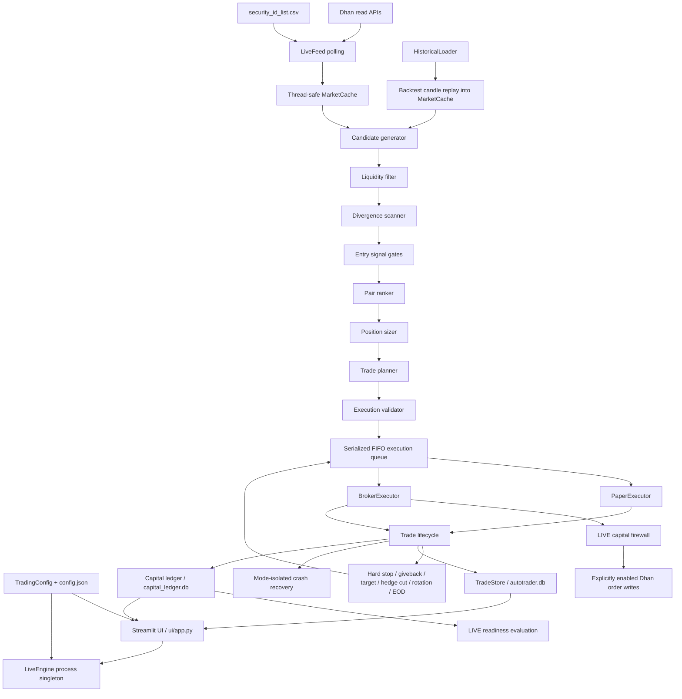

# AutoTrader System Evolution and Current Architecture

**Coverage period:** 2026-07-13 through 2026-07-14 (Asia/Calcutta)  
**Repository:** `chatgpt_auto_trader`  
**Application version:** `6.0.0`  
**Document status:** Current engineering handoff and requirement-precedence record  
**Last verified:** 2026-07-14, 90 tests passing

## 1. Why this document exists

This document records the architectural changes, requirement changes, safety upgrades, strategy behavior, execution flow, test evidence, and unresolved risks introduced on July 13 and July 14, 2026. It is intended to let a new engineer or AI understand the system without reconstructing decisions from chat history.

The repository also contains `requirements and architecture.txt`. That file is historically important, but several of its requirements were changed by later user decisions and verified implementation work. For work performed after July 14, 2026, use this precedence order:

1. The user's newest explicit instruction.
2. This document's **Current Approved Requirement** and **Safety Invariants** sections.
3. Tested behavior in the current source tree.
4. The legacy `requirements and architecture.txt` specification.
5. Older README/changelog descriptions.

Do not silently restore an older requirement merely because it appears in the legacy specification.

## 2. Non-negotiable safety invariants

These constraints were repeatedly confirmed by the user and must be preserved:

- PAPER is simulated trading only. PAPER must never place, cancel, modify, or otherwise submit a real broker order.
- Tests must never submit real Dhan orders.
- `DhanClient` order writes are disabled by default and require an explicitly order-enabled client created only by the LIVE executor.
- `live_trading_enabled` defaults to `false`; LIVE must remain unavailable until deliberately enabled.
- A selected LIVE strategy allocation is a hard strategy ceiling, not the full Dhan account balance. If Dhan has ₹100,000 and the UI allocation is ₹40,000, the strategy must not use the remaining ₹60,000.
- Capital or allocation changes are allowed only when the engine is stopped and no position is open.
- Changing the LIVE allocation must not clear or bypass a same-day LIVE daily-loss stop.
- PAPER may continue finding new trades after the daily-loss threshold; those trades are tagged `-SL` / `POST-SL` for analysis.
- PAPER and LIVE use the same per-trade hard-stop and exit logic.
- Both CE and PE legs must use the same lot quantity.
- Lots and units per leg must be visible in the active-position cards and trade journal.
- Market data must fail closed. Missing or invalid quotes must never be replaced with invented option prices.
- Preserve the configured backtest dates `2026-06-09` through `2026-07-13` unless the user deliberately changes them.
- Do not add unrelated observer, workflow, or generated agent files.
- Do not commit or push changes unless the user explicitly requests it.

## 3. Current operating state

At the end of the documented phase:

| Setting | Current value |
|---|---:|
| Execution mode | `PAPER` |
| LIVE order switch | `false` |
| Base/selected capital | ₹45,000 |
| NIFTY lot size | 65 units |
| Maximum deployment | 90% of current strategy equity |
| Temporary maximum units per leg | 1,800 |
| Maximum lots at lot size 65 | 27 lots / 1,755 units |
| Per-trade hard stop | 3% of strategy equity frozen at entry |
| Daily loss threshold | 3% of selected session capital |
| Scan interval | 120 seconds |
| Risk-monitor interval | 1 second |
| Entry window | 09:30–15:10 IST |
| Position-management/EOD window | through 15:20 IST |
| Backtest dates | 2026-06-09 to 2026-07-13 |
| Automated tests | 90 passing |

The 1,800-unit ceiling is a temporary safety ceiling. It replaced the earlier uncapped low-premium behavior that produced examples such as 179 or 247 lots. Quantity remains dynamic below the ceiling, but a ₹1–₹2 premium pair can no longer consume hundreds of lots merely because the premium is small. Revalidate the applicable exchange/broker freeze quantity before any future LIVE release.

## 4. Change timeline

### 4.1 July 13, 00:28 — commit `367a1e2`

Commit: `v6-bug-fixes-time-00-28-am-13-july`

Main changes:

- Reworked historical-data loading and per-day alignment.
- Added strike and spot fields to historical candles.
- Improved synthetic spot reconstruction for backtests.
- Added target-P&L persistence so backtest target exits could avoid candle-close overshoot.
- Introduced gross P&L, transaction cost, and net P&L reporting.
- At this point transaction costs were still the incorrect flat `₹103 × lots` formula.
- Added SQLite columns/migrations for gross and net P&L.
- Updated backtest results to classify wins, losses, drawdown, and returns using net P&L.
- Expanded Excel output to show gross P&L, costs, and net P&L.
- Expanded Streamlit backtest metrics and equity curves to distinguish gross and net performance.
- Changed the historical date configuration during that development phase.

### 4.2 July 13, 12:01 — commit `1ad4a72`

Commit: `v6-bugs&ui changes from 9am to 11 am on 13th july`

Main changes:

- Changed configured capital from ₹30,000 to ₹45,000.
- Made PAPER the configured execution mode.
- Increased allowed cache age from 1 second to 10 seconds.
- Expanded the Dhan wrapper and added credential preflight validation.
- Replaced the earlier structural live-feed stub with Dhan quote polling based on `security_id_list.csv`.
- Added active-expiry discovery and security-ID mappings.
- Added quote, volume, OI, depth, synthetic-spot, and latency updates to `MarketCache`.
- Added an engine activity log and operational diagnostics.
- Added manual start/stop/reset controls and active-position status cards.
- Added realized, active, and total-day P&L cards.
- Added UI journal filtering and clearer exit-reason labels.
- Added process recovery behavior for Streamlit reruns.
- Added offline/fallback observability. This fallback was later removed for PAPER/LIVE price safety because synthetic prices are not acceptable for simulated execution validation.

### 4.3 July 13, 21:35 — commit `708a21c`

Commit: `v6-bugs&ui changes from 2pm to 4 pm on 13th july`

Main changes:

- Hardened Dhan credential failures and error messages.
- Made engine status recovery date-aware and trading-hours-aware.
- Prevented an old `running=true` status from automatically restarting on another day or outside 09:30–15:20.
- Added the CE/PE premium-similarity test and a 10% maximum premium-difference filter.
- Replaced Streamlit-session-only engine persistence with a process-level singleton protected by an initialization lock.
- Improved dashboard styling and journal display formatting.

### 4.4 July 14, 12:38 — commit `2e96597`, merged as `b742289`

Commit: `Harden paper execution and correct option transaction costs`  
Merge: pull request #1, `codex/safety-price-integrity-paper-sl`

Main changes:

- Replaced the flat `₹103 × lots` cost estimate with order/turnover-based Dhan option charges.
- Added `core/transaction_costs.py` and a structured cost breakdown.
- PAPER buys now fill at ask and sells at bid.
- PAPER limit entries fill only if both asks are marketable against both limits; otherwise the entire pair fails atomically.
- Missing executable prices now fail closed.
- Preserved equal dynamic quantities on both legs.
- Added explicit lots and units-per-leg visibility.
- Added `post_daily_sl`, `display_id`, and `-SL` tagging.
- PAPER continues after the daily threshold; LIVE remains blocked.
- Added transaction-cost-aware ranker, target, and rotation calculations.
- Added per-contract quote timestamps and stronger cache validation.
- Removed synthetic PAPER/LIVE price fallback after feed initialization failure.
- Added regression tests covering fill integrity, price integrity, cache integrity, costs, tagging, quantity visibility, and PAPER daily-stop behavior.
- Test count at that point: 43 passing.

### 4.5 July 14, current working tree — not yet committed

This phase is intentionally still uncommitted. It adds the following:

- Dynamic per-trade hard stop based on remaining strategy equity at entry.
- Hard stop preserved after hedge cut in Phase 2.
- Temporary 1,800-unit-per-leg sizing ceiling.
- 90% deployment limit for entry outlay and cost reserve.
- Rejection of dual-decay candidates where both CE and PE velocities are non-positive.
- Rejection of pairs where both contracts are OTM relative to spot.
- Rejection of candidates with non-positive projected net profit.
- Near-expiry guard: SIDEWAYS paired buying disabled near expiry; directional trades restricted to ATM/near-ATM.
- Selected-contract timestamp validation rather than relying only on global cache freshness.
- Finite, positive, non-inverted quote validation in `MarketCache`.
- Mode locking and capital locking for a running engine session.
- PAPER/LIVE recovery-state separation.
- Stale exit-signal and duplicate-entry execution checks.
- Exact per-leg open-unit tracking.
- Broker fill confirmation using broker-reported filled quantity and average traded price.
- Cancellation of pending order remainders after timeout.
- Automatic unwind of a confirmed or partially confirmed entry leg when the basket fails.
- Partial-exit state that preserves the exact remaining CE and PE units.
- Default-off Dhan write access.
- Read-only Dhan funds synchronization.
- Independent LIVE capital firewall.
- Append-only PAPER/LIVE capital transaction ledger.
- Stopped-and-flat PAPER refill/withdrawal-to-target UI.
- Stopped-and-flat LIVE allocation UI.
- Persistent same-day LIVE daily-stop latch.
- Cost-inclusive PAPER profitability/readiness gate before LIVE.
- Streamlit deprecation cleanup (`width="stretch"`).
- Background-thread logging no longer calls Streamlit and no longer produces `ScriptRunContext` warnings from `LiveFeed`.
- Breaker and entry-scan log throttling.
- Reset behavior no longer erases realized P&L history.
- Backtest date inputs now preserve the configured dates rather than silently replacing them with rolling defaults.
- Test count increased to 90 passing.

New files in this phase:

- `database/capital_ledger.py`
- `execution/capital_firewall.py`
- `strategy/live_readiness.py`
- `tests/test_broker_executor_safety.py`
- `tests/test_capital_ledger.py`
- `tests/test_critical_findings_regression.py`
- `tests/test_live_capital_firewall.py`
- `tests/test_live_readiness.py`

## 5. Old requirements versus current approved requirements

| Area | Legacy/earlier requirement | Current approved requirement and implementation |
|---|---|---|
| Core position | Buy winning leg; opposite leg described as tracked/held but not clearly purchased | Buy both CE and PE in Phase 1 with identical lots. `direction` identifies the expected winning leg. |
| Pair scope | ATM pair or ranked pair remained an open question | Scan a CE × PE matrix within ATM ± configured strikes, then filter, score, and rank. |
| Divergence band | 1%–1.5% | Configurable; current default 1%–5%. |
| Change anchor | Pair-discovery-relative was selected historically | Current scanner uses each cached option's preserved `open` versus current `last`; in backtest this is candle open versus close. This is not a clean implementation of a new anchor per pair-discovery event. |
| Capital | ₹30,000 project allocation | Configurable, currently ₹45,000. LIVE uses exactly the UI-selected strategy allocation, never the whole broker balance. |
| Quantity | Dynamic, identical; no cap originally | Dynamic and identical, with 90% deployment and a temporary 1,800-unit-per-leg ceiling. |
| 179/247-lot low-premium trades | Initially treated as valid dynamic behavior | Later audit proved this was unsafe. Current behavior caps at 27 lots for a 65-unit lot size. |
| Per-trade stop | 2% of capital allocated to the entered contract | 3% of total remaining strategy equity at entry. The rupee stop is frozen on the trade and applies in Phase 1 and Phase 2. |
| Daily stop | 3% of total allocation, stop all new trades | LIVE exits/blocks and latches for the day. PAPER continues testing and tags later trades `-SL`. |
| PAPER after daily stop | Originally expected to stop | Continues scanning and entering, but each trade retains the same hard-stop/exit behavior as LIVE. |
| Sideways strategy | Deferred until Directional validated | Current engine contains Sideways behavior, including limit entry, dynamic target, and rotation. It remains unproven and is blocked near expiry. |
| Trading cutoff | No entries after 15:00; final close unresolved | Last entry 15:10; force flatten at 15:20. |
| Transaction cost | Flat ₹103 per lot was introduced July 13 | Four-order, turnover-based Dhan/NSE option cost model. |
| PAPER fills | LTP/current quote behavior | Long entries at ask; exits at bid; invalid prices fail closed. |
| LIVE activation | Explicit switch | Explicit `live_trading_enabled=true`, plus readiness gate, allocation firewall, broker funds check, daily latch, and fill confirmation. |
| Expiry behavior | Not defined | Near expiry, reject Sideways paired buying and require directional strikes within configured near-ATM distance. |
| Deposits/refills | Not defined | PAPER-only simulated deposits/withdrawals are audited and do not erase or count as strategy P&L. |
| LIVE funding | Capital UI independent of broker balance | UI allocation remains independent but cannot exceed read-only broker-confirmed available funds. No fund transfer is performed. |

## 6. Current high-level architecture



## 7. Module responsibilities

### Configuration and domain

- `config/settings.py`: dataclass defaults, derived risk values, JSON loading/saving, project paths, Dhan credentials.
- `config.json`: current user-editable values. It is runtime state, so preserve user date changes.
- `core/models.py`: candles, candidates, scored candidates, plans, trades, day sessions, execution signals, P&L, units, costs, and SL display IDs.
- `core/enums.py`: execution modes, regimes, directions, order types, phases, signals, and exit reasons.
- `core/transaction_costs.py`: current two-leg round-trip option charge calculation.
- `core/exceptions.py`: fail-closed execution and partial-fill exception types.

### Data

- `data/historical_loader.py`: calls Dhan expired-options history, parses responses, resamples, aligns CE/PE timestamps, and groups by date.
- `data/live_feed.py`: reads the security master, selects the nearest valid expiry, polls Dhan quote data every five seconds, updates quotes/security IDs/latency, and calculates a synthetic spot from put-call parity.
- `data/market_cache.py`: thread-safe single source for spot, ATM, expiry, option quotes, security IDs, IV, VWAP, and health state.
- `data/dhan_client.py`: Dhan wrapper. Read methods are allowed by default; order placement/cancellation require `orders_enabled=True`.

### Strategy

- `pair_candidate_generator.py`: produces the CE × PE Cartesian pair set inside the configured ATM range.
- `liquidity_filter.py`: filters individual CE and PE strikes before rebuilding the Cartesian set.
- `divergence_scanner.py`: calculates CE/PE percentage velocity and absolute divergence.
- `entry_signal.py`: applies divergence, directional consistency, dual-decay, and both-OTM rules.
- `pair_ranker.py`: applies premium similarity, estimated cost/slippage, projected-net-profit, liquidity confidence, and selects the highest projected-net pair.
- `regime_detector.py`: classifies Directional UP/DOWN or Sideways from VWAP position, price structure, ATR expansion, and range width.
- `position_sizer.py`: calculates dynamic equal lots using current equity, combined premium, deployment percentage, lot size, and unit ceiling.
- `trade_planner.py`: chooses market orders for Directional and limit orders for Sideways.
- `exit_manager.py`: Phase 1 hard stop, peak giveback, and Sideways target.
- `hedge_cut_manager.py`: transitions a profitable Directional pair from both legs to a single winning leg.
- `single_leg_exit_manager.py`: Phase 2 hard stop and winning-leg giveback.
- `rotation_engine.py`: requires banked profit, score improvement, divergence improvement, time remaining, and cooldown clearance.
- `daily_circuit_breaker.py`: detects the configured session threshold and logs only state transitions.
- `live_readiness.py`: evaluates closed PAPER results independently of deposits.

### Execution and state

- `execution/execution_validator.py`: last pre-order quote, expiry, capital, spread, cache, quantity, and overlap gate.
- `execution/execution_queue.py`: serializes entry/exit/rotation/hedge-cut actions.
- `execution/paper_executor.py`: ask-side entry and bid-side exit simulation with no broker writes.
- `execution/broker_executor.py`: LIVE order construction, capital authorization, placement, fill polling, cancellation, unwind, and partial-unit tracking.
- `execution/capital_firewall.py`: compares required entry funds with selected allocation, reserve-adjusted deployable allocation, and broker-confirmed funds.
- `execution/crash_recovery.py`: mode-isolated PAPER/LIVE trade/P&L state and date/time-aware engine status.
- `database/trade_store.py`: SQLite trade lifecycle persistence with in-place schema migration.
- `database/capital_ledger.py`: append-only capital transactions and persistent LIVE daily-stop latch.

### Presentation and reporting

- `ui/app.py`: process singleton, engine orchestration, tabs, controls, activity logs, position cards, capital controls, and journal.
- `ui/trade_view.py`: legacy-safe lots/units/SL display helpers.
- `reporting/excel_export.py`: Summary, Trade Journal, and Daily Summary workbook.

## 8. Current pair-selection process

The exact live/PAPER selection path is:

1. `LiveFeed` populates real Dhan option quotes, active expiry, and security IDs in `MarketCache`.
2. `LiveEngine` waits for a positive spot price and trading hours.
3. It classifies the current regime.
4. `PairCandidateGenerator` selects available CE and PE strikes within `ATM ± pair_scan_range` and creates every CE × PE combination.
5. The engine deduplicates CE and PE strike lists.
6. `LiquidityFilter` filters each side before rebuilding the Cartesian set:
   - Live/PAPER volume ≥ 100.
   - Live/PAPER OI ≥ 1,000.
   - Per-leg spread ≤ max(₹0.50, 2% of mid-price).
   - Backtest uses volume ≥ 5 because historical depth/OI is incomplete.
7. `DivergenceScanner` calculates:

   ```text
   CE velocity = ((CE last - CE open) / CE open) × 100
   PE velocity = ((PE last - PE open) / PE open) × 100
   divergence = abs(CE velocity - PE velocity)
   ```

8. `EntrySignal` rejects:
   - Both velocities ≤ 0 (dual premium decay).
   - CE strike above spot and PE strike below spot simultaneously (both OTM).
   - Divergence outside the configured 1%–5% default band.
   - Directionally inconsistent winning legs in Directional mode.
9. `PairRanker` uses executable asks in PAPER/LIVE and close/LTP in backtest.
10. It rejects pairs whose CE/PE premiums differ by more than 10% of their average premium.
11. It estimates expected combined movement, four-order round-trip costs, and ₹10 slippage per lot.
12. It rejects projected net profit ≤ 0.
13. It assigns confidence from spreads, volume, and OI and rejects confidence below 70%.
14. It selects the candidate with the highest projected net profit.
15. `PositionSizer` uses current strategy equity and both executable premiums to determine equal lots.
16. `TradePlanner` creates a two-leg plan.
17. `ExecutionValidator` revalidates the selected pair immediately before queueing:
   - No active position.
   - Cache and selected quotes fresh.
   - Valid bid/ask on both legs.
   - No both-OTM pair.
   - Expiry rules satisfied.
   - Quantity positive.
   - Ask-side entry outlay within deployable equity.
   - Combined spread within limits.
18. `_execute_signal` checks again for an active trade and, in LIVE, checks the persistent daily-stop latch.

Important discrepancy: the legacy requirement said percentage change should be anchored when a pair is first discovered. The current cache preserves the option's first observed `open`, while backtest uses candle open. There is no explicit per-pair discovery-anchor object. Do not describe the current implementation as exact pair-discovery anchoring until this is redesigned and tested.

## 9. Sizing and capital formulas

### PAPER equity

```text
PAPER equity = base capital + realized net trading P&L
               + net simulated deposits/withdrawals
```

Trade-P&L ledger rows are visible for audit but are excluded from the cash-adjustment sum to avoid double counting.

### Dynamic lots

```text
lot cost = (CE executable entry price + PE executable entry price) × lot size
deployable equity = current strategy equity × 90%
capital lots = floor(deployable equity / lot cost)
ceiling lots = floor(max units per leg / lot size)
final lots = min(capital lots, ceiling lots)
units per leg = final lots × lot size
```

Both legs always receive `final lots`.

### Per-trade hard stop

At execution time:

```text
risk capital at entry = current strategy equity
hard stop rupees = risk capital at entry × 3%
```

Both values are frozen into `Trade`. Later deposits or allocation changes cannot widen an already-open trade's stop. The stop compares **net P&L after estimated transaction costs** and remains active after a hedge cut.

### Daily threshold

```text
daily threshold = selected session capital × 3%
```

- LIVE: an active trade is exited, future entries are blocked, and the stop is persisted for that calendar date.
- PAPER: the threshold remains visible, but scanning continues. New trades receive `post_daily_sl=True` and display as `<trade-id>-SL`.
- A PAPER refill restores simulated available equity but does not rewrite or hide the realized loss.

## 10. Transaction-cost model

The July 14 model estimates a two-leg buy followed by a two-leg sell:

- Brokerage: ₹20 per executed option order × 4 orders = ₹80.
- NSE option transaction charge: `0.0003552 × total premium turnover`.
- STT: `0.0015 × sell premium turnover`.
- SEBI turnover fee: `0.000001 × total turnover`.
- Stamp duty: `0.00003 × buy turnover`.
- GST: 18% of brokerage + exchange charge + SEBI fee.

This model fixed the invalid ₹2,000+ cost displayed for low-priced contracts under the old `₹103 × lots` formula. Rates are time-sensitive and must be reverified against official Dhan/NSE/tax sources before LIVE activation.

## 11. Trade lifecycle and exits

### Phase 1: both legs open

- Both CE and PE are long with equal units.
- Direction identifies which leg was expected to win.
- Hard stop: exit both when net P&L breaches the frozen 3% rupee limit.
- Giveback: after positive combined P&L establishes a peak, exit if current combined P&L falls below 90% of that peak.
- Sideways target: estimated round-trip costs + 4%/5%/6% of combined entry premium based on IV percentile + ₹8. The target is multiplied by 1.5 during pre-close.
- Directional hedge cut: if combined gross P&L reaches ₹300 when winning-leg value is below ₹10,000, or 2.5% of winning-leg value otherwise, close the losing leg.

### Phase 2: single winning leg open

- The losing leg's realized P&L is retained.
- The winning leg remains open.
- The same frozen net hard stop remains active.
- The winning leg uses its own peak and 10% giveback rule.

### Partial exit

- LIVE partial fills move the trade to `PARTIAL_EXIT`.
- Exact `ce_open_units` and `pe_open_units` are retained.
- Retry logic sells only recorded remaining units, preventing duplicate/full-quantity exit orders.

### Rotation

Rotation requires all relevant conditions:

- Current trade has at least the configured banked profit floor.
- Candidate projected net score exceeds current score plus hysteresis.
- Candidate divergence is faster.
- Candidate is not in cooldown.
- At least 60 seconds remain before EOD.
- Directional Phase 2 pauses rotation.

The old trade is completely closed and persisted before a new entry is attempted. If the close causes a LIVE daily-stop breach, the replacement entry is blocked.

### EOD

All open trades are queued for square-off at 15:20 IST.

## 12. Execution-mode behavior

### BACKTEST

- Uses historical expired-option candles grouped by trading day.
- Replays data through most of the same strategy components.
- Bypasses live cache/latency/spread gates that historical data cannot satisfy.
- Market entry fills at the next/current replay candle open.
- Limit entry requires both limits to fall within candle high/low.
- Ordinary exits use candle close.
- Does not place broker orders.

### PAPER

- Uses live Dhan quote data but `PaperExecutor` only.
- No `BrokerExecutor` instance is retained for the PAPER session.
- Entry buys both legs at ask.
- Limit entry is atomic across both legs.
- Exit sells at bid.
- Missing/invalid executable prices block the operation.
- Continues after daily threshold with `-SL` tagging.
- Supports audited simulated refill/withdrawal.

### LIVE

LIVE start currently requires all of the following:

1. `execution_mode == "LIVE"`.
2. `live_trading_enabled == true`.
3. No same-day persistent LIVE daily-stop latch.
4. PAPER readiness gate passes.
5. Dhan credentials validate.
6. Strategy allocation is positive and selected while stopped/flat.
7. Each entry passes the independent capital firewall using current asks, estimated costs, selected allocation, reserve, and read-only broker funds.

The broker executor waits for broker-reported fills, not mere placement acceptance. Pending remainders are cancelled. If one entry leg fills and the other fails, the filled quantity is unwound. If an exit partially fills, exact remaining units are persisted.

## 13. Capital controls and audit ledger

`CapitalLedger` maintains an append-only SQLite table with:

- `DEPOSIT`
- `WITHDRAWAL`
- `TRADE_PNL`
- `ALLOCATION_CHANGE`
- `BROKER_BALANCE_SYNC` (type reserved; UI currently reads funds without creating a dedicated sync row)

PAPER target refill example:

```text
Base capital:           ₹45,000.00
Realized PAPER P&L:    -₹36,365.35
Current PAPER equity:   ₹8,634.65
Target PAPER equity:   ₹45,000.00
Recorded deposit:       ₹36,365.35
```

The loss remains in trading P&L. The deposit is a separate transaction and cannot make readiness profitability appear positive.

LIVE allocation changes record the previous/new allocation delta, broker-confirmed available balance, resulting allocation, note, and timestamp. No Dhan fund transfer is performed.

## 14. LIVE readiness gate

LIVE is blocked unless cost-inclusive PAPER ledger evidence satisfies all defaults:

- At least 50 closed PAPER trades.
- At least 5 distinct PAPER trading days.
- Positive total net PAPER P&L.
- Profit factor ≥ 1.20.
- Maximum drawdown ≤ 10% of the selected LIVE allocation.

Deposits and withdrawals do not count as trade results. Passing this gate is not a profit guarantee; it is only a minimum evidence threshold.

## 15. UI behavior

The Streamlit UI has three tabs:

1. Backtest Engine.
2. Live Monitoring for PAPER/LIVE.
3. Historical Trade Journal and Capital Transaction Ledger.

Sidebar behavior:

- Execution mode is locked while running.
- Start saves the current configuration before constructing the session.
- A running session freezes its mode and capital even if the JSON file changes.
- Stop is prohibited for LIVE while a tracked broker position remains open.
- Reset attempts an emergency exit first and no longer erases realized P&L or audit history.
- PAPER shows remaining equity, base, trading P&L, net cash adjustments, target equity, note, and apply button.
- LIVE shows the readiness report, read-only Dhan fund refresh, broker available funds, selected strategy allocation, note, and apply button.
- Capital buttons are disabled while running or while any position is open.
- Position cards display strike, entry price, lots, units per leg, phase, and P&L.
- Journal displays trade ID, SL status, lots, units, per-leg prices, gross P&L, costs, and net P&L.

## 16. Persistence and recovery

- `autotrader.db` stores trade lifecycle records.
- `capital_ledger.db` stores capital transactions and LIVE daily-stop dates.
- Recovery files are separated by mode (`PAPER` and `LIVE`).
- Legacy unscoped state may migrate into PAPER, but is never trusted as LIVE state.
- Engine running status stores date and only auto-recovers during 09:30–15:20 on the same date.
- LIVE entry reconciliation blocks new entries when the broker reports untracked open positions. It deliberately does not auto-liquidate them because they could be manual/unrelated positions.

## 17. Test coverage

The verified suite contains 90 tests. Important categories:

- Dhan writes disabled by default.
- Selected allocation versus full broker balance.
- Missing broker funds fail closed.
- Allocation reserve enforcement.
- Entry and exit fill confirmation.
- One-leg placement containment and automatic unwind.
- Partial-fill cancellation and exact remaining units.
- PAPER ask/bid fill behavior.
- Atomic PAPER limit baskets.
- Equal quantities and lots/units display.
- Dynamic sizing and unit ceiling.
- Turnover-based costs.
- Dual-decay, both-OTM, expiry, stale quote, invalid quote, and capital gates.
- Hard stop based on remaining equity.
- Hard stop after hedge cut.
- PAPER post-daily-SL continuation/tagging.
- LIVE daily-stop persistence across restart/allocation changes.
- PAPER/LIVE recovery-state isolation.
- Capital ledger audit behavior.
- Deposits excluded from profitability.
- Live readiness thresholds.
- Streamlit singleton/store/monitor reuse and background-thread safety.

Verification command:

```bash
python -m pytest -q
```

Last verified result:

```text
90 passed
```

## 18. Operational procedures

### 18.1 Start the application

From Git Bash with the virtual environment active:

```bash
python -m streamlit run ui/app.py
```

Do not use Windows-style `\.venv\Scripts\python.exe` syntax directly in Git Bash; use the activated `python`, or `./.venv/Scripts/python.exe` if a direct path is necessary.

### 18.2 Backtest workflow

1. Stop any running PAPER/LIVE engine.
2. Select BACKTEST.
3. Confirm dates and capital.
4. Run the backtest.
5. Review gross P&L, costs, net P&L, win rate, profit factor, and drawdown.
6. Export the Excel workbook when required.
7. Treat results cautiously because historical relative-strike data cannot reproduce the full live option matrix.

### 18.3 PAPER workflow

1. Confirm `execution_mode=PAPER` and `live_trading_enabled=false`.
2. Confirm the Dhan credentials are valid for read-only quotes.
3. With the engine stopped and flat, set/refill the target PAPER equity if required.
4. Start the engine.
5. Expect risk checks every second and entry scans no more often than every 120 seconds.
6. Monitor quote freshness, health status, candidate counts, active P&L, hard-stop amounts, lots, and units.
7. Review `-SL` trades separately after the daily threshold.
8. Stop the engine before changing capital or mode.
9. Review the Trade Journal and Capital Transaction Ledger.

### 18.4 LIVE workflow — prohibited until unresolved blockers are cleared

1. Resolve every P0 item in the next section.
2. Revalidate Dhan API behavior, static-IP requirements, freeze quantity, taxes, and fees against current official documentation.
3. Complete a sustained PAPER run and pass readiness.
4. Stop the engine and ensure there is no open position.
5. Refresh Dhan funds read-only.
6. Set the exact strategy allocation. Do not select the whole balance unless that is intentional.
7. Explicitly enable `live_trading_enabled` only after review.
8. Start with the smallest acceptable allocation and independently monitor Dhan positions/order book.

## 19. Known limitations and unresolved risks

Passing tests does not mean the strategy is profitable or production-ready. The following issues must remain visible.

### P0 — must be resolved before LIVE

1. **Live regime inputs are placeholders.** `LiveEngine` currently appends spot as its VWAP input and uses a constant ATR value of `2.0`. This makes regime classification unreliable and can force/overproduce SIDEWAYS behavior. Wire real VWAP, high, low, and ATR series before LIVE.
2. **Synthetic spot feed.** `LiveFeed` calculates NIFTY spot from option put-call parity rather than consuming a true NIFTY index feed. Validate accuracy and staleness under real market conditions.
3. **Initial spot seed.** `LiveFeed` begins from a hardcoded `24300.0` seed before deriving an updated synthetic spot. A far-away market can cause the first polled strike window to miss the real ATM region.
4. **No demonstrated profitability.** Recent PAPER observations produced substantial losses. The readiness gate blocks LIVE, but the entry/exit strategy itself still requires empirical improvement.
5. **Broker integration has only fake-client automated tests.** Partial-fill logic is thoroughly unit-tested, but a controlled Dhan sandbox or non-ordering integration environment is still required.
6. **Transaction/freeze parameters are date-sensitive.** Cost rates and the temporary 1,800-unit ceiling must be revalidated immediately before LIVE.

### P1 — important correctness/observability work

1. Live feed polls ATM ±350 points, while the default candidate range is ATM ±10 strikes (normally ±500 points). The candidate generator cannot rank strikes the feed did not load.
2. `TradeStore.save_trade()` logs and swallows persistence failures. A LIVE close could succeed at the broker while journal persistence fails without stopping the engine.
3. Journal execution-mode filtering still uses a June-2026 date heuristic instead of a persisted execution-mode column.
4. Readiness uses new PAPER `TRADE_PNL` capital-ledger rows. Older closed paper trades that predate the ledger are not automatically backfilled.
5. The legacy pair-discovery-relative anchor is not explicitly modeled.
6. Backtest and live execution are not fully equivalent: backtests lack executable bid/ask depth and broad historical chain data.
7. Historical synthetic spot includes a hardcoded fallback for June 2026 if candle strike/spot is absent. Remove or explicitly label any result that uses it.
8. There is no in-application Dhan account-wide kill-switch button by user choice. Operational broker-side emergency procedures must be documented separately before LIVE.

### P2 — maintainability improvements

1. `ui/app.py` contains UI rendering and the full live orchestrator; splitting orchestration from presentation would reduce risk.
2. Capital ledger P&L idempotency is checked in application code; a unique database constraint on mode/type/reference would be stronger under concurrency.
3. Add structured run/session IDs so deposits, trades, strategy configuration, and readiness can be grouped by test campaign.
4. Persist quote-source and fallback metadata in backtest reports.

## 20. Rules for the next AI or engineer

Before changing strategy behavior:

1. Read this entire document.
2. Inspect `git status`; preserve unrelated user changes.
3. Confirm `config.json` dates before and after work.
4. Keep PAPER structurally isolated from broker order writes.
5. Write a failing regression test before each behavior change.
6. Test executable ask/bid prices, not only LTP.
7. Never weaken an existing safety assertion just to make tests pass.
8. Do not treat deposits as profit.
9. Do not bypass the LIVE readiness gate by increasing allocation.
10. Do not claim profitability from passing unit tests.
11. Run `python -m pytest -q`, compilation, and `git diff --check` before completion.
12. Do not commit or push without explicit user authorization.

## 21. External reference points

- Dhan orders, statuses, cancellation, partial fills, and slicing: <https://dhanhq.co/docs/v2/orders/>
- Dhan funds and margin: <https://dhanhq.co/docs/v2/funds/>
- Dhan trader controls: <https://dhanhq.co/docs/v2/traders-control/>

These links are reference points only. Recheck their current contents before changing LIVE behavior.

## 22. Verification snapshot

The documented state was verified with:

```text
Python compileall: passed
pytest: 90 passed
git diff --check: passed
execution_mode: PAPER
live_trading_enabled: false
backtest_from_date: 2026-06-09
backtest_to_date: 2026-07-13
real broker orders during testing: none
```
